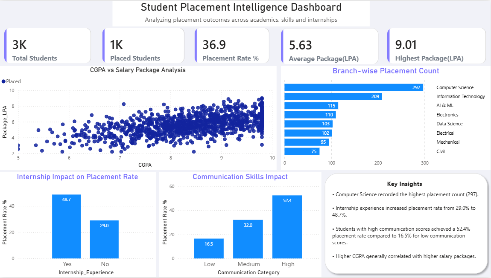

# Student Placement Intelligence Dashboard

## Overview

This Power BI dashboard analyzes student placement outcomes and identifies the key factors influencing placement success.

## Tools Used

- Power BI
- DAX
- Excel

## KPIs

- Total Students
- Placed Students
- Placement Rate %
- Average Package (LPA)
- Highest Package (LPA)

## Key Insights

- Computer Science recorded the highest placement count.
- Students with internship experience achieved a higher placement rate.
- Communication skills showed a strong impact on placement success.
- Higher CGPA generally correlated with higher salary packages.

## Dashboard Preview

